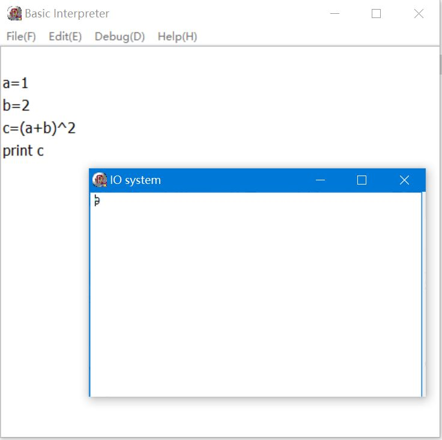

# Simple BASIC Interpreter Written in Pascal

## Overview
BasicL is a low-level BASIC-like programming language based on simple instructions.
The project was developed with Delphi 2005 with Reliable performance.

## Objective
The project is used to provide the foundation of high-level programming languages, that is, as intermediate code.

## Executable file

